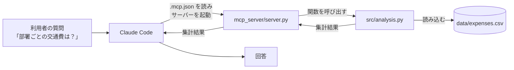

# 交通費データ分析 MCPサーバー（動作検証用）

交通費精算データ（CSV）の集計関数を、MCP（Model Context Protocol）のツールとして Claude Code に公開するリポジトリです。
Claude Code に日本語で質問すると、Claude がこのリポジトリの集計関数を呼び出して回答します。

本リポジトリは、DX/AX演習「AIエージェントと回すソフトウェア開発V字モデル演習」の第4段階で用いる構成について、Claude Code（Web版）のクラウドセッション上で動作するかを確認するために用意したものです。

---

## 1. MCPとは

MCP（Model Context Protocol）は、AIアプリケーションと外部のツールやデータを接続するための公開仕様です。
MCPに対応したプログラム（MCPサーバー）を用意すると、AIは、そのプログラムが提供する機能（ツール）を必要に応じて呼び出せるようになります。

演習では、MCPを次の2つの段階で扱います。

| 段階 | MCPとの関わり | 内容 |
|---|---|---|
| 第3段階 | 既製のMCPを使う | Claude Code に組み込まれた GitHub 用のツールで、Issue の参照やプルリクエストの作成を行う |
| 第4段階 | 自作のMCPを使う | テスト済みの集計関数を、本リポジトリの構成で Claude Code のツールとして公開する |

---

## 2. 仕組み



1. Claude Code は、セッションの開始時に `.mcp.json` を読み、記載されたプログラム（`mcp_server/server.py`）を起動します
2. 利用者が質問すると、Claude は質問に合うツールを選んで呼び出します
3. `server.py` は `src/analysis.py` の集計関数を呼び出し、結果を Claude に返します
4. Claude は結果をもとに回答を作成します

`server.py` には計算の処理を書いていません。計算はすべて `src/analysis.py` が担います。
演習では `src/analysis.py` を受講者がテスト駆動開発（TDD）で作成するため、「テストで正しさを確認した関数だけを AI に公開する」構成になります。

---

## 3. ファイル構成

```text
.
├── .mcp.json             … MCPサーバーの登録（Claude Code が起動時に読む設定ファイル）
├── README.md             … 本ファイル
├── requirements.txt      … 使用する Python パッケージ
├── data/
│   └── expenses.csv      … 疑似データ（5件）
├── mcp_server/
│   └── server.py         … MCPサーバー本体（集計関数をツールとして公開する）
└── src/
    └── analysis.py       … 集計関数（本リポジトリでは動作検証用の仮実装）
```

### `.mcp.json` の内容

```json
{
  "mcpServers": {
    "expense-analysis": {
      "type": "stdio",
      "command": "python3",
      "args": ["${CLAUDE_PROJECT_DIR:-.}/mcp_server/server.py"],
      "env": {
        "EXPENSE_CSV": "${CLAUDE_PROJECT_DIR:-.}/data/expenses.csv"
      }
    }
  }
}
```

| 項目 | 意味 |
|---|---|
| `expense-analysis` | サーバーの名前。Claude Code からは `mcp__expense-analysis__ツール名` として参照される |
| `type: "stdio"` | Claude Code がサーバーを子プロセスとして起動し、標準入出力で通信する方式 |
| `command` / `args` | サーバーを起動するコマンド |
| `${CLAUDE_PROJECT_DIR:-.}` | リポジトリのルートの場所。Claude Code が値を設定する。未設定の場合は現在のフォルダを指す |
| `env` | サーバーに渡す環境変数。分析対象の CSV ファイルの場所を指定している |

### 疑似データの列

`data/expenses.csv` の列は、交通費精算アプリの要件定義書（`docs/01_requirements.md` の「5. 出力データの項目」）と同じです。

| 列名 | 例 |
|---|---|
| 利用日 | 2026-10-08 |
| 申請者名 | 香川 太郎 |
| 部署 | 営業部 |
| 出発地 | 高松 |
| 到着地 | 丸亀 |
| 交通手段 | 自家用車 |
| 距離(km) | 30 |
| 金額(円) | 450 |
| 承認ステータス | 自動承認 |

---

## 4. 公開しているツール

| ツール名 | 内容 | 引数 | 戻り値の例 |
|---|---|---|---|
| `total_by_department` | 部署ごとの合計金額 | なし | `{"営業部": 1450, ...}` |
| `total_by_month` | 月ごと（YYYY-MM）の合計金額 | なし | `{"2026-10": 15250, ...}` |
| `total_by_transport` | 交通手段ごとの合計金額 | `department`（部署名。省略すると全部署） | `{"自家用車": 450, ...}` |

---

## 5. 事前準備

### 5.1 クラウド環境に `mcp` パッケージを導入する

MCPサーバーは、Claude Code のセッション開始時に起動されます。
この時点で `mcp` パッケージが導入されていない場合、サーバーの起動に失敗し、ツールが表示されません。
そのため、セッションの開始前にパッケージが導入される「セットアップスクリプト」を設定します。

1. [claude.ai/code](https://claude.ai/code) を開き、メッセージ入力欄の上にある雲のアイコン（環境名）を選択する
2. **Cloud** を選び、使用する環境にカーソルを合わせ、右に表示される歯車アイコンを選択する
3. **Setup script** 欄に次の内容を入力し、保存する

```bash
#!/bin/bash
pip install -q streamlit pandas pytest "mcp<2" || true
```

組織共有の演習環境が用意されている場合は、その環境を選択します（この手順は不要です）。

### 5.2 `mcp` のバージョンを 1.x に固定する理由

`mcp` パッケージの 2.x では、本リポジトリで用いている `FastMCP` が `MCPServer` に名称変更されており、`server.py` が起動しません。
Web 上の解説やサンプルの多くが 1.x の記法であるため、本リポジトリでは `mcp<2`（1.x 系）に固定しています。

---

## 6. 動作確認の手順

1. [claude.ai/code](https://claude.ai/code) でこのリポジトリを選択する
2. 5.1 で設定した環境が選択されていることを確認する
3. 次の指示を送信する

```text
利用可能なMCPツールを列挙してください。
続いて expense-analysis の total_by_department を呼び出し、結果をそのまま表示してください。
```

4. 続けて、ツール名を指定せずに日本語で質問する

```text
部署ごとの交通費の合計を教えてください。
営業部は、どの交通手段にいくら使っていますか？
```

### 期待される結果

| 確認点 | 期待値 |
|---|---|
| ツールの一覧 | `mcp__expense-analysis__total_by_department`、`mcp__expense-analysis__total_by_month`、`mcp__expense-analysis__total_by_transport` が含まれる |
| 部署別合計 | 企画部 14,250円、営業部 1,450円、総務部 8,000円 |
| 月別合計 | 2026-09 が 8,450円、2026-10 が 15,250円 |
| 営業部の交通手段別合計 | 自家用車 450円、電車 1,000円 |

手順4で、Claude がツール名を指定されなくても自らツールを選択して呼び出し、上記と一致する金額を回答すれば、第4段階で想定する動作が成立しています。

---

## 7. うまくいかない場合

| 症状 | 考えられる原因 | 対処 |
|---|---|---|
| ツールの一覧に `expense-analysis` が表示されない | `.mcp.json` が読み込まれていない。ファイル名の誤り（先頭の `.` の欠落など）や、リポジトリ直下以外への配置 | ファイル名と配置場所を確認し、新しいセッションを開始する |
| ツールは表示されるが、呼び出すとエラーになる | `mcp` パッケージが未導入、または 2.x が導入されている | Claude に `python3 -c "import mcp, importlib.metadata as m; print(m.version('mcp'))"` の実行を指示し、バージョンを確認する |
| 金額が期待値と異なる | `data/expenses.csv` の内容が変更されている | CSV の内容を確認する |
| `.mcp.json` を修正したのに反映されない | `.mcp.json` はセッションの開始時にのみ読み込まれる | 新しいセッションを開始する |

ファイルの配置が正しく、`mcp` も導入済みであるにもかかわらずツールが表示されない場合、クラウドセッションが `.mcp.json` を読み込んでいない可能性があります（同様の報告が [anthropics/claude-code#54441](https://github.com/anthropics/claude-code/issues/54441) にあります）。
この場合、第4段階は講師によるデモ（PC にインストールした Claude Code での実行）に切り替えます。

---

## 8. 注意事項

- **`src/analysis.py` は動作検証用の仮実装です。** 演習本番では、受講者が第2段階でテスト駆動開発により作成します。演習用テンプレートリポジトリには、このファイルを含めません
- **`server.py` の中で `print()` を使ってはいけません。** 標準出力は Claude Code との通信に使われるため、文字を出力すると通信が成立しなくなります
- **`data/expenses.csv` は疑似データです。** 実在の人物・組織とは関係ありません
- 集計関数の名前と引数を変更する場合は、`mcp_server/server.py` の呼び出し部分も合わせて変更してください

---

## 9. 参考資料

- [Model Context Protocol](https://modelcontextprotocol.io/)
- [Connect Claude Code to tools via MCP（Claude Code ドキュメント）](https://code.claude.com/docs/en/mcp)
- [Use Claude Code in the cloud（Claude Code ドキュメント）](https://code.claude.com/docs/en/claude-code-on-the-web)
- [Configure cloud environments（Claude Code ドキュメント）](https://code.claude.com/docs/en/cloud-environments)
